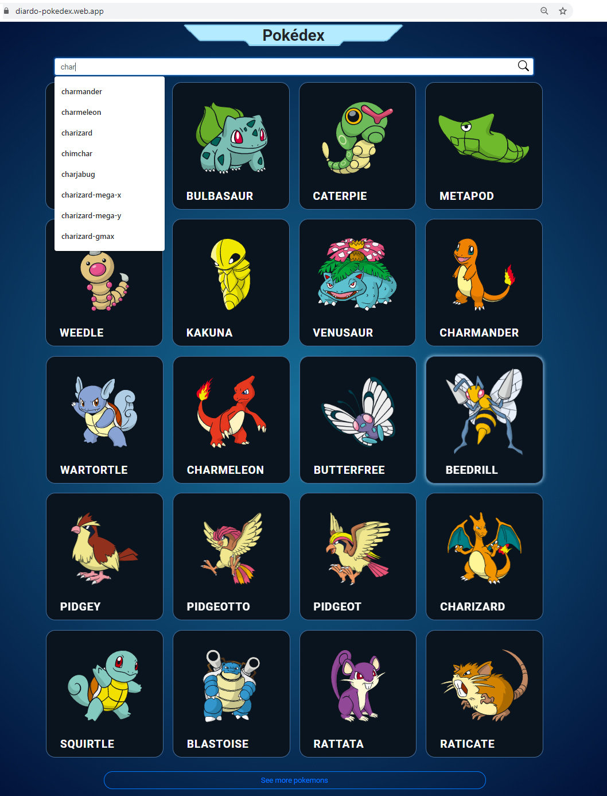

# Pokedex

A very simple pokemon dex website using Vue JS (Responsive Web & Mobile),  
Has  2 Pages (Home and Details)
- Home Page display pokemon list, with unlimited render (button at bottom)
- Search box has autocomplete feature. (if you type "char" will show "charmender", "charmeleon", "charizard", etc)
- Detail Page display detail pokemon, and have link to their Evolution chain. (charmender has link to charmeleon and charizard, caterpie has link to metapod and butterfree, etc)
### Demo Link : http://diardo-pokedex.web.app/
 

# Screenshoot
### Browser

### Mobile
